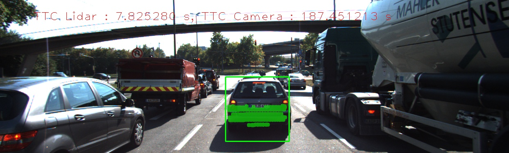

# TASK FP. 1 Match 3D Objects
This section is addressed by doing an overall loop through the vector of DMatch (matched keypoints). With each set of matched keypoints, we find the bounding box for both the current frame and the previous frame. Once we find out this relationship of bounding boxes between two frame, we insert this important date into a multimap to keep track of it.

We want to find the bounding box relationship with the highest number with keypoints. The next routine uses the "forward relationship (which I define as current frame box to previous frame box)" to analyzes the weight (number of keypoints) associated with each bounding box. We are able to filter out many of the bounding box relationship that has small weight (e.g. keypoints enclosed).

At this point, however, we have only did half of the filtering. We then use the "reverse relationship (which I define as previous frame box to current frame box)" and analyze the weight and eliminate any redundant relationship.

At this point we should have the optimized bounding box relationship, and we will pass this information back to the program (store in pointed memory).

# TASK MP. 2 Compute Lidar-based TTC
This section is address by first finding the minimum distance. In order to filter out the outliers, we first sort the vector of lidar points with the custom sort function, and then we walk through the sorted vector to find the minimum value that can be validated by having neighboring values. We define a custom threshold (e.g 5cm) and and require a set number of neighbor (e.g 5 neigboring points) to be found before we consider this point to be valid.

We carry out this filter for both set of lidar points from current frame and previous frame. Once we have obtained the minimum distance values, we calculate the constant velocity based TTC based on the the instructor's equation.

# TASK MP. 3 Keypoint Removal
This section is addressed by referencing the roi member variable associated with each bounding box. We loop through the vector of matched keypoints and check if each keypoint is within the roi of the referenced bounding box. Once this check is passed, we uses the index to add the keypoints and matched keypoint set (DMatch) to the bounding box's member variable.

# TASK MP. 4 Keypoint Descriptors
This section is address by first iterate through the keypoints to find a list of distance pairs, calculate the distance ratio, and storing the data into a vector for future use.

We then find the median value of the vector, which is more robust than using the mean value.

# TASK MP. 5 Performance Evaluation
Three examples are investigated below:

## List of Offenders
There are four images that shows the lidar measurement being obviously off.
- Image Sequence 5 (reference)

- Image Sequence 6 (off!)

- Image Sequence 7 (off!)

- Image Sequence 8 (Innocent)

- Image Sequence 9 (off!)

## Descriptions

Essentially, the issues are mainly related to the shape of the back of the car. More details will be explained. There are 

Up to image sequence 5, the lidar TTC seems normal. However, at sequence 6, there is an abrupt drop from 14.5s to 6.8. The picture below shows that at sequence 6, the license plate has been picked up. This additional blimp threw off the TTC calculation.
- Top view of sequence 5 for reference

- Top view of sequence 6, showing license plate being picked up

At Sequence 7, the license plate is lost from the lidar detection. This again threw off the TTC calculation.
- Top view of sequence 7, showing license plate no longer being detected

At Sequence 9, we have an interesting detection of the partial bumper. If you look closely at the back of the preceding car (VW), you will see that if the lidar scan the top of the bumper, it will only find the two sides protruding out, and the middle actually looks like an alcove.

# TASK MP. 6 Performance Evaluation
The following shows the frame-by-frame combination of all possible combinations of detector and descriptors used in this course.

In particular, the follwing list shows the occurence of camera TTC data that are clearly off.
- Harris Corner + BRISK, BRIEF, ORB, FREAK SIFT
- FAST + BRIEF, SIFT
- ORB + BRISK, BRIEF, ORB, FREAK, SIFT

From visual inspection, the cause of the issue are typicaly related to badly chosen keypoints. This would correlate to the findings that for certain detector methods such as Harris Corner and ORB, the TTC estimation will be bad quality no matter what descriptor method is used.

## Combination: [SHITOMASI] and [BRISK]
|Image # |Lidar TTC| Camera TTC | Remarks |
|--- |---:|---:|---|
|1|12.9722|13.3176||
|2|12.264|13.0927||
|3|13.9161|13.4054||
|4|14.8865|12.4879||
|5|14.5057|12.0542||
|6|6.82612|15.3942||
|7|34.3404|12.9||
|8|28.9577|14.6577||
|9|7.82528|11.1691||
|10|18.0318|13.4042||
|11|14.9877|11.1182||
|12|10.1|11.7642||
|13|9.22307|11.8396||
|14|10.9678|11.342||
|15|8.09422|10.009||
|16|8.81392|10.1477||
|17|10.2926|11.1376||
|18|8.30978|9.87553||

## Combination: [SHITOMASI] and [BRIEF]
|Image # |Lidar TTC| Camera TTC | Remarks |
|--- |---:|---:|---|
|1|12.9722|13.5031||
|2|12.264|14.6389||
|3|13.9161|12.6387||
|4|14.8865|11.5958||
|5|14.5057|12.4414||
|6|6.82612|13.7589||
|7|34.3404|12.8329||
|8|28.9577|13.2117||
|9|7.82528|11.1536||
|10|18.0318|13.9418||
|11|14.9877|10.9146||
|12|10.1|11.8858||
|13|9.22307|12.2277||
|14|10.9678|11.8438||
|15|8.09422|10.9711||
|16|8.81392|12.8031||
|17|10.2926|11.1061||
|18|8.30978|9.76267||

## Combination: [SHITOMASI] and [ORB]
|Image # |Lidar TTC| Camera TTC | Remarks |
|--- |---:|---:|---|
|1|12.9722|13.9012||
|2|12.264|13.0553||
|3|13.9161|12.7||
|4|14.8865|12.4201||
|5|14.5057|12.3511||
|6|6.82612|14.1323||
|7|34.3404|11.4079||
|8|28.9577|13.6508||
|9|7.82528|11.2653||
|10|18.0318|13.922||
|11|14.9877|10.7395||
|12|10.1|11.848||
|13|9.22307|12.6088||
|14|10.9678|11.1959||
|15|8.09422|10.4584||
|16|8.81392|12.9428||
|17|10.2926|10.2716||
|18|8.30978|10.2699||

## Combination: [SHITOMASI] and [FREAK]
|Image # |Lidar TTC| Camera TTC | Remarks |
|--- |---:|---:|---|
|1|12.9722|13.1247||
|2|12.264|12.8903||
|3|13.9161|12.0821||
|4|14.8865|12.3378||
|5|14.5057|11.848||
|6|6.82612|13.49||
|7|34.3404|12.2347||
|8|28.9577|11.5965||
|9|7.82528|11.9106||
|10|18.0318|13.9613||
|11|14.9877|11.5524||
|12|10.1|11.6267||
|13|9.22307|12.0341||
|14|10.9678|11.8034||
|15|8.09422|9.65331||
|16|8.81392|10.7263||
|17|10.2926|11.5895||
|18|8.30978|7.3291||

## Combination: [SHITOMASI] and [AKAZE]
|Image # |Lidar TTC| Camera TTC | Remarks |
|--- |---:|---:|---|

The combination: [SHITOMASI] and [AKAZE] cannot yield.

## Combination: [SHITOMASI] and [SIFT]
|Image # |Lidar TTC| Camera TTC | Remarks |
|--- |---:|---:|---|
|1|12.9722|14.1124||
|2|12.264|13.5599||
|3|13.9161|11.99||
|4|14.8865|12.807||
|5|14.5057|12.1886||
|6|6.82612|14.8921||
|7|34.3404|12.8804||
|8|28.9577|13.9179||
|9|7.82528|11.6494||
|10|18.0318|13.9356||
|11|14.9877|11.356||
|12|10.1|11.9749||
|13|9.22307|11.9904||
|14|10.9678|11.342||
|15|8.09422|12.2506||
|16|8.81392|11.4428||
|17|10.2926|10.9094||
|18|8.30978|10.2986||

## Combination: [HARRISCORNER] and [BRISK]
|Image # |Lidar TTC| Camera TTC | Remarks |
|--- |---:|---:|---|
|1|12.9722|10.9082||
|2|12.264|10.586||
|3|13.9161|-80.8525|WAY OFF!!|
|4|14.8865|11.5792||
|5|14.5057|44.9166|WAY OFF!!|
|6|6.82612|12.9945||
|7|34.3404|12.2||
|8|28.9577|17.6204||
|9|7.82528|nan|WAY OFF!!|
|10|18.0318|-inf|WAY OFF!!|
|11|14.9877|11.7414||
|12|10.1|11.6948||
|13|9.22307|568.322|WAY OFF!!|
|14|10.9678|5.6061|WAY OFF!!|
|15|8.09422|-13.6263||
|16|8.81392|6.65726|WAY OFF!!|
|17|10.2926|12.5848||
|18|8.30978|-inf|WAY OFF!!|

## Combination: [HARRISCORNER] and [BRIEF]
|Image # |Lidar TTC| Camera TTC | Remarks |
|--- |---:|---:|---|
|1|12.9722|10.9082||
|2|12.264|11.0081||
|3|13.9161|-11.4731|WAY OFF!!|
|4|14.8865|11.7693||
|5|14.5057|34.7543|WAY OFF!!|
|6|6.82612|15.2483||
|7|34.3404|12.3379||
|8|28.9577|17.6204||
|9|7.82528|3.30058|WAY OFF!!|
|10|18.0318|186.357|WAY OFF!!|
|11|14.9877|11.7414||
|12|10.1|11.6948||
|13|9.22307|13.4327||
|14|10.9678|5.6061|WAY OFF!!|
|15|8.09422|-13.6263|WAY OFF!!|
|16|8.81392|7.29175||
|17|10.2926|12.5848||
|18|8.30978|-inf|WAY OFF!!|

## Combination: [HARRISCORNER] and [ORB]
|Image # |Lidar TTC| Camera TTC | Remarks |
|--- |---:|---:|---|
|1|12.9722|10.9082||
|2|12.264|11.0081||
|3|13.9161|-11.4731|WAY OFF!!|
|4|14.8865|11.5792||
|5|14.5057|34.7543|WAY OFF!!|
|6|6.82612|13.2712||
|7|34.3404|13.712||
|8|28.9577|12.3725||
|9|7.82528|3.18421|WAY OFF!!|
|10|18.0318|nan|WAY OFF!!|
|11|14.9877|0.212715|WAY OFF!!|
|12|10.1|11.5139||
|13|9.22307|13.4327||
|14|10.9678|5.85828|WAY OFF!!|
|15|8.09422|-12.639||
|16|8.81392|6.52962||
|17|10.2926|12.5848||
|18|8.30978|-inf|WAY OFF!!|

## Combination: [HARRISCORNER] and [FREAK]
|Image # |Lidar TTC| Camera TTC | Remarks |
|--- |---:|---:|---|
|1|12.9722|9.74953||
|2|12.264|10.586||
|3|13.9161|nan|WAY OFF!!|
|4|14.8865|12.629||
|5|14.5057|13.6432||
|6|6.82612|11.8034||
|7|34.3404|12.2792||
|8|28.9577|12.9162||
|9|7.82528|nan|WAY OFF!!|
|10|18.0318|186.357|WAY OFF!!|
|11|14.9877|23.627||
|12|10.1|11.6948||
|13|9.22307|0.552495|WAY OFF!!|
|14|10.9678|0.16126|WAY OFF!!|
|15|8.09422|-25.2781|WAY OFF!!|
|16|8.81392|6.87135||
|17|10.2926|12.5848||
|18|8.30978|25.6763||

## Combination: [HARRISCORNER] and [AKAZE]
|Image # |Lidar TTC| Camera TTC | Remarks |
|--- |---:|---:|---|

The combination: [HARRISCORNER] and [AKAZE] cannot yield.

## Combination: [HARRISCORNER] and [SIFT]
|Image # |Lidar TTC| Camera TTC | Remarks |
|--- |---:|---:|---|
|1|12.9722|10.9082||
|2|12.264|63.8475|WAY OFF!!|
|3|13.9161|-80.8525|WAY OFF!!|
|4|14.8865|11.5792||
|5|14.5057|13.6432||
|6|6.82612|27.8744||
|7|34.3404|13.497||
|8|28.9577|13.5704||
|9|7.82528|3.93864|WAY OFF!!|
|10|18.0318|-13.4405||
|11|14.9877|11.4377||
|12|10.1|11.6948||
|13|9.22307|13.4327||
|14|10.9678|5.66097||
|15|8.09422|-inf|WAY OFF!!|
|16|8.81392|7.29175||
|17|10.2926|12.5848||
|18|8.30978|-inf|WAY OFF!!|

## Combination: [FAST] and [BRISK]
|Image # |Lidar TTC| Camera TTC | Remarks |
|--- |---:|---:|---|
|1|12.9722|11.9698||
|2|12.264|12.1065||
|3|13.9161|13.3596||
|4|14.8865|12.9039||
|5|14.5057|17.2315||
|6|6.82612|13.1897||
|7|34.3404|12.5792||
|8|28.9577|11.5751||
|9|7.82528|11.9557||
|10|18.0318|12.4915||
|11|14.9877|13.203||
|12|10.1|11.9904||
|13|9.22307|12.0888||
|14|10.9678|11.7851||
|15|8.09422|10.8648||
|16|8.81392|12.0961||
|17|10.2926|10.1798||
|18|8.30978|11.7904||

## Combination: [FAST] and [BRIEF]
|Image # |Lidar TTC| Camera TTC | Remarks |
|--- |---:|---:|---|
|1|12.9722|12.478||
|2|12.264|11.4009||
|3|13.9161|13.9157||
|4|14.8865|12.7877||
|5|14.5057|-inf|WAY OFF!!|
|6|6.82612|13.344||
|7|34.3404|18.3297||
|8|28.9577|11.5467||
|9|7.82528|12.0538||
|10|18.0318|12.5265||
|11|14.9877|14.3957||
|12|10.1|10.8955||
|13|9.22307|11.9162||
|14|10.9678|10.7149||
|15|8.09422|12.768||
|16|8.81392|10.5611||
|17|10.2926|8.85072||
|18|8.30978|11.6009||

## Combination: [FAST] and [ORB]
|Image # |Lidar TTC| Camera TTC | Remarks |
|--- |---:|---:|---|
|1|12.9722|11.5066||
|2|12.264|13.0881||
|3|13.9161|13.4545||
|4|14.8865|13.1441||
|5|14.5057|56.3064||
|6|6.82612|13.3851||
|7|34.3404|12.4713||
|8|28.9577|11.8662||
|9|7.82528|11.7271||
|10|18.0318|13.2907||
|11|14.9877|14.1495||
|12|10.1|13.1487||
|13|9.22307|12.0531||
|14|10.9678|11.488||
|15|8.09422|11.7034||
|16|8.81392|12.2391||
|17|10.2926|10.287||
|18|8.30978|10.6505||

## Combination: [FAST] and [FREAK]
|Image # |Lidar TTC| Camera TTC | Remarks |
|--- |---:|---:|---|
|1|12.9722|10.8342||
|2|12.264|11.9931||
|3|13.9161|12.3427||
|4|14.8865|13.2215||
|5|14.5057|13.5717||
|6|6.82612|12.347||
|7|34.3404|12.3204||
|8|28.9577|11.805||
|9|7.82528|11.7216||
|10|18.0318|13.8374||
|11|14.9877|12.2753||
|12|10.1|11.4||
|13|9.22307|11.7136||
|14|10.9678|12.3306||
|15|8.09422|10.8452||
|16|8.81392|11.0096||
|17|10.2926|11.5131||
|18|8.30978|11.7451||

## Combination: [FAST] and [AKAZE]
|Image # |Lidar TTC| Camera TTC | Remarks |
|--- |---:|---:|---|

The combination: [FAST] and [AKAZE] cannot yield.

## Combination: [FAST] and [SIFT]
|Image # |Lidar TTC| Camera TTC | Remarks |
|--- |---:|---:|---|
|1|12.9722|11.7503||
|2|12.264|11.4066||
|3|13.9161|13.9811||
|4|14.8865|14.0766||
|5|14.5057|52.5313|WAY OFF!!|
|6|6.82612|13.4382||
|7|34.3404|13.327||
|8|28.9577|12.9952||
|9|7.82528|12.6403||
|10|18.0318|13.8374||
|11|14.9877|14.7288||
|12|10.1|12.3389||
|13|9.22307|12.6564||
|14|10.9678|11.7411||
|15|8.09422|11.8212||
|16|8.81392|11.6541||
|17|10.2926|7.42279||
|18|8.30978|10.7801||

## Combination: [BRISK] and [BRISK]
|Image # |Lidar TTC| Camera TTC | Remarks |
|--- |---:|---:|---|
|1|12.9722|12.9112||
|2|12.264|18.5994||
|3|13.9161|13.482||
|4|14.8865|18.0764||
|5|14.5057|31.969||
|6|6.82612|18.6869||
|7|34.3404|16.9065||
|8|28.9577|15.2226||
|9|7.82528|14.8875||
|10|18.0318|13.5409||
|11|14.9877|11.9113||
|12|10.1|10.4849||
|13|9.22307|13.0573||
|14|10.9678|12.3978||
|15|8.09422|13.8756||
|16|8.81392|11.3584||
|17|10.2926|10.098||
|18|8.30978|12.4801||

## Combination: [BRISK] and [BRIEF]
|Image # |Lidar TTC| Camera TTC | Remarks |
|--- |---:|---:|---|
|1|12.9722|12.47||
|2|12.264|15.1979||
|3|13.9161|13.5691||
|4|14.8865|16.6159||
|5|14.5057|14.351||
|6|6.82612|19.3259||
|7|34.3404|14.3278||
|8|28.9577|18.7451||
|9|7.82528|17.4147||
|10|18.0318|14.1101||
|11|14.9877|11.6251||
|12|10.1|13.287||
|13|9.22307|14.2285||
|14|10.9678|11.0632||
|15|8.09422|11.971||
|16|8.81392|12.9529||
|17|10.2926|8.64688||
|18|8.30978|12.5229||

## Combination: [BRISK] and [ORB]
|Image # |Lidar TTC| Camera TTC | Remarks |
|--- |---:|---:|---|
|1|12.9722|17.9299||
|2|12.264|17.8711||
|3|13.9161|15.0292||
|4|14.8865|15.4038||
|5|14.5057|17.3463||
|6|6.82612|22.9222||
|7|34.3404|14.0882||
|8|28.9577|14.9138||
|9|7.82528|15.3908||
|10|18.0318|12.0348||
|11|14.9877|12.4881||
|12|10.1|12.6734||
|13|9.22307|13.5222||
|14|10.9678|13.0148||
|15|8.09422|10.2453||
|16|8.81392|12.6647||
|17|10.2926|8.72506||
|18|8.30978|12.0675||

## Combination: [BRISK] and [FREAK]
|Image # |Lidar TTC| Camera TTC | Remarks |
|--- |---:|---:|---|
|1|12.9722|12.2345||
|2|12.264|17.0882||
|3|13.9161|12.4216||
|4|14.8865|17.0807||
|5|14.5057|27.8948||
|6|6.82612|14.1249||
|7|34.3404|17.7959||
|8|28.9577|16.1681||
|9|7.82528|14.1645||
|10|18.0318|12.3599||
|11|14.9877|12.8096||
|12|10.1|11.8983||
|13|9.22307|12.3341||
|14|10.9678|10.9739||
|15|8.09422|14.8144||
|16|8.81392|9.88602||
|17|10.2926|9.70895||
|18|8.30978|9.84613||

## Combination: [BRISK] and [AKAZE]
|Image # |Lidar TTC| Camera TTC | Remarks |
|--- |---:|---:|---|

The combination: [BRISK] and [AKAZE] cannot yield.

## Combination: [BRISK] and [SIFT]
|Image # |Lidar TTC| Camera TTC | Remarks |
|--- |---:|---:|---|
|1|12.9722|14.2189||
|2|12.264|16.3297||
|3|13.9161|17.5451||
|4|14.8865|14.8251||
|5|14.5057|35.5038||
|6|6.82612|17.5157||
|7|34.3404|16.6098||
|8|28.9577|21.9634||
|9|7.82528|18.5587||
|10|18.0318|18.2784||
|11|14.9877|15.7334||
|12|10.1|11.2061||
|13|9.22307|13.525||
|14|10.9678|11.2737||
|15|8.09422|16.8347||
|16|8.81392|12.5386||
|17|10.2926|10.2745||
|18|8.30978|12.8654||

## Combination: [ORB] and [BRISK]
|Image # |Lidar TTC| Camera TTC | Remarks |
|--- |---:|---:|---|
|1|12.9722|19.4375||
|2|12.264|12.4655||
|3|13.9161|12.0855||
|4|14.8865|28.8362||
|5|14.5057|98.5803|WAY OFF!!|
|6|6.82612|10.8411||
|7|34.3404|15.5782||
|8|28.9577|10.6521||
|9|7.82528|14.6258||
|10|18.0318|19.6544||
|11|14.9877|7.78781||
|12|10.1|52.7806|WAY OFF!!|
|13|9.22307|9.30432||
|14|10.9678|9.59546||
|15|8.09422|8.13611||
|16|8.81392|11.1232||
|17|10.2926|18.7733||
|18|8.30978|22.7976||

## Combination: [ORB] and [BRIEF]
|Image # |Lidar TTC| Camera TTC | Remarks |
|--- |---:|---:|---|
|1|12.9722|12.6572||
|2|12.264|11.4755||
|3|13.9161|33.3428||
|4|14.8865|27.5168||
|5|14.5057|46.4846|WAY OFF!!|
|6|6.82612|11.5751||
|7|34.3404|41.228||
|8|28.9577|666.929|WAY OFF!!|
|9|7.82528|-inf|WAY OFF!!|
|10|18.0318|10.7785||
|11|14.9877|14.0291||
|12|10.1|13.9637||
|13|9.22307|14.3865||
|14|10.9678|10.9328||
|15|8.09422|13.1413||
|16|8.81392|12.4911||
|17|10.2926|16.4118||
|18|8.30978|17.6604||

## Combination: [ORB] and [ORB]
|Image # |Lidar TTC| Camera TTC | Remarks |
|--- |---:|---:|---|
|1|12.9722|16.7807||
|2|12.264|10.9367||
|3|13.9161|13.2146||
|4|14.8865|53.3994|WAY OFF!!|
|5|14.5057|62.4677|WAY OFF!!|
|6|6.82612|-inf|WAY OFF!!|
|7|34.3404|-inf|WAY OFF!!|
|8|28.9577|9.14171||
|9|7.82528|727.219|WAY OFF!!|
|10|18.0318|-inf|WAY OFF!!|
|11|14.9877|9.2983||
|12|10.1|-inf|WAY OFF!!|
|13|9.22307|9.91242||
|14|10.9678|9.55639||
|15|8.09422|24.6352||
|16|8.81392|13.6656||
|17|10.2926|8.84033||
|18|8.30978|38.6619||

## Combination: [ORB] and [FREAK]
|Image # |Lidar TTC| Camera TTC | Remarks |
|--- |---:|---:|---|
|1|12.9722|11.9371||
|2|12.264|12.2395||
|3|13.9161|11.0246||
|4|14.8865|10.781||
|5|14.5057|-inf|WAY OFF!!|
|6|6.82612|11.5816||
|7|34.3404|-inf|WAY OFF!!|
|8|28.9577|8.95665||
|9|7.82528|13.47||
|10|18.0318|-inf|WAY OFF!!|
|11|14.9877|5.96008||
|12|10.1|14.9136||
|13|9.22307|6.3262||
|14|10.9678|38.4661||
|15|8.09422|8.12918||
|16|8.81392|6.34289||
|17|10.2926|11.3219||
|18|8.30978|24.1855||

## Combination: [ORB] and [AKAZE]
|Image # |Lidar TTC| Camera TTC | Remarks |
|--- |---:|---:|---|

The combination: [ORB] and [AKAZE] cannot yield.

## Combination: [ORB] and [SIFT]
|Image # |Lidar TTC| Camera TTC | Remarks |
|--- |---:|---:|---|
|1|12.9722|12.2449||
|2|12.264|10.6151||
|3|13.9161|12.1221||
|4|14.8865|36.6792||
|5|14.5057|68.0965|WAY OFF!!|
|6|6.82612|19.9934||
|7|34.3404|-inf|WAY OFF!!|
|8|28.9577|9.68069||
|9|7.82528|13.8176||
|10|18.0318|10.8711||
|11|14.9877|10.1214||
|12|10.1|-inf|WAY OFF!!|
|13|9.22307|8.10843||
|14|10.9678|13.7643||
|15|8.09422|9.86543||
|16|8.81392|9.56045||
|17|10.2926|15.7547||
|18|8.30978|27.9094||

## Combination: [AKAZE] and [BRISK]
|Image # |Lidar TTC| Camera TTC | Remarks |
|--- |---:|---:|---|
|1|12.9722|12.541||
|2|12.264|14.7125||
|3|13.9161|13.6204||
|4|14.8865|15.0237||
|5|14.5057|14.8486||
|6|6.82612|14.4872||
|7|34.3404|15.489||
|8|28.9577|14.3985||
|9|7.82528|14.5873||
|10|18.0318|11.8601||
|11|14.9877|12.41||
|12|10.1|11.0537||
|13|9.22307|10.3195||
|14|10.9678|9.53734||
|15|8.09422|9.54567||
|16|8.81392|10.8561||
|17|10.2926|9.65304||
|18|8.30978|9.19748||

## Combination: [AKAZE] and [BRIEF]
|Image # |Lidar TTC| Camera TTC | Remarks |
|--- |---:|---:|---|
|1|12.9722|13.1732||
|2|12.264|15.0838||
|3|13.9161|13.5277||
|4|14.8865|14.7404||
|5|14.5057|15.964||
|6|6.82612|14.4234||
|7|34.3404|16.0691||
|8|28.9577|15.1393||
|9|7.82528|16.7064||
|10|18.0318|12.2369||
|11|14.9877|12.946||
|12|10.1|11.0177||
|13|9.22307|10.6492||
|14|10.9678|9.90656||
|15|8.09422|9.30771||
|16|8.81392|10.878||
|17|10.2926|9.20609||
|18|8.30978|9.22085||

## Combination: [AKAZE] and [ORB]
|Image # |Lidar TTC| Camera TTC | Remarks |
|--- |---:|---:|---|
|1|12.9722|11.8977||
|2|12.264|16.4223||
|3|13.9161|14.1133||
|4|14.8865|14.8278||
|5|14.5057|15.8293||
|6|6.82612|13.2415||
|7|34.3404|16.0322||
|8|28.9577|14.1828||
|9|7.82528|13.9724||
|10|18.0318|12.2097||
|11|14.9877|11.516||
|12|10.1|10.6577||
|13|9.22307|11.0915||
|14|10.9678|10.7418||
|15|8.09422|10.4494||
|16|8.81392|10.5782||
|17|10.2926|9.22961||
|18|8.30978|9.24845||

## Combination: [AKAZE] and [FREAK]
|Image # |Lidar TTC| Camera TTC | Remarks |
|--- |---:|---:|---|
|1|12.9722|12.3568||
|2|12.264|13.9175||
|3|13.9161|13.9098||
|4|14.8865|13.9818||
|5|14.5057|15.7248||
|6|6.82612|14.4622||
|7|34.3404|15.8297||
|8|28.9577|13.4054||
|9|7.82528|14.1313||
|10|18.0318|12.5877||
|11|14.9877|12.3747||
|12|10.1|11.0521||
|13|9.22307|10.7093||
|14|10.9678|9.26376||
|15|8.09422|9.98226||
|16|8.81392|10.3034||
|17|10.2926|9.72712||
|18|8.30978|9.10764||

## Combination: [AKAZE] and [AKAZE]
|Image # |Lidar TTC| Camera TTC | Remarks |
|--- |---:|---:|---|
|1|12.9722|12.9808||
|2|12.264|14.9308||
|3|13.9161|13.0437||
|4|14.8865|14.712||
|5|14.5057|16.5794||
|6|6.82612|14.5307||
|7|34.3404|15.3299||
|8|28.9577|14.7601||
|9|7.82528|15.1412||
|10|18.0318|11.9563||
|11|14.9877|13.0308||
|12|10.1|11.5013||
|13|9.22307|11.5102||
|14|10.9678|10.3706||
|15|8.09422|10.2609||
|16|8.81392|10.3352||
|17|10.2926|9.2723||
|18|8.30978|9.35721||

## Combination: [AKAZE] and [SIFT]
|Image # |Lidar TTC| Camera TTC | Remarks |
|--- |---:|---:|---|
|1|12.9722|12.9738||
|2|12.264|14.9065||
|3|13.9161|13.5174||
|4|14.8865|14.2641||
|5|14.5057|17.1286||
|6|6.82612|15.32||
|7|34.3404|15.6082||
|8|28.9577|14.3311||
|9|7.82528|15.5193||
|10|18.0318|12.2329||
|11|14.9877|12.2457||
|12|10.1|11.4108||
|13|9.22307|12.0499||
|14|10.9678|10.9048||
|15|8.09422|10.2327||
|16|8.81392|10.8063||
|17|10.2926|9.34563||
|18|8.30978|9.37838||

## Combination: [SIFT] and [BRISK]
|Image # |Lidar TTC| Camera TTC | Remarks |
|--- |---:|---:|---|
|1|12.9722|13.8221||
|2|12.264|12.5863||
|3|13.9161|13.664||
|4|14.8865|19.2699||
|5|14.5057|15.1343||
|6|6.82612|11.7207||
|7|34.3404|14.9145||
|8|28.9577|15.7812||
|9|7.82528|12.83||
|10|18.0318|9.39425||
|11|14.9877|13.4072||
|12|10.1|9.20322||
|13|9.22307|10.2522||
|14|10.9678|8.9499||
|15|8.09422|9.61236||
|16|8.81392|9.18657||
|17|10.2926|9.65319||
|18|8.30978|9.77068||

## Combination: [SIFT] and [BRIEF]
|Image # |Lidar TTC| Camera TTC | Remarks |
|--- |---:|---:|---|
|1|12.9722|14.0214||
|2|12.264|13.9181||
|3|13.9161|14.6528||
|4|14.8865|20.5742||
|5|14.5057|15.5927||
|6|6.82612|12.1175||
|7|34.3404|13.6546||
|8|28.9577|14.4177||
|9|7.82528|13.2061||
|10|18.0318|10.4843||
|11|14.9877|13.875||
|12|10.1|10.3419||
|13|9.22307|10.2172||
|14|10.9678|9.5125||
|15|8.09422|9.62571||
|16|8.81392|9.08103||
|17|10.2926|9.02803||
|18|8.30978|9.83391||

## Combination: [SIFT] and [ORB]
|Image # |Lidar TTC| Camera TTC | Remarks |
|--- |---:|---:|---|

The combination: [SIFT] and [ORB] cannot yield.

## Combination: [SIFT] and [FREAK]
|Image # |Lidar TTC| Camera TTC | Remarks |
|--- |---:|---:|---|
|1|12.9722|14.8484||
|2|12.264|13.941||
|3|13.9161|14.1035||
|4|14.8865|19.0051||
|5|14.5057|14.9931||
|6|6.82612|12.1175||
|7|34.3404|16.5557||
|8|28.9577|15.914||
|9|7.82528|13.1392||
|10|18.0318|11.2191||
|11|14.9877|12.7582||
|12|10.1|9.80036||
|13|9.22307|9.70654||
|14|10.9678|9.68854||
|15|8.09422|8.96753||
|16|8.81392|8.91621||
|17|10.2926|9.36416||
|18|8.30978|8.80788||

## Combination: [SIFT] and [AKAZE]
|Image # |Lidar TTC| Camera TTC | Remarks |
|--- |---:|---:|---|

The combination: [SIFT] and [AKAZE] cannot yield.

## Combination: [SIFT] and [SIFT]
|Image # |Lidar TTC| Camera TTC | Remarks |
|--- |---:|---:|---|
|1|12.9722|12.3904||
|2|12.264|12.4918||
|3|13.9161|12.6424||
|4|14.8865|16.9977||
|5|14.5057|15.5552||
|6|6.82612|11.1096||
|7|34.3404|13.2097||
|8|28.9577|14.6616||
|9|7.82528|12.786||
|10|18.0318|10.9675||
|11|14.9877|11.8025||
|12|10.1|9.49106||
|13|9.22307|10.3234||
|14|10.9678|9.35469||
|15|8.09422|9.10475||
|16|8.81392|8.97689||
|17|10.2926|8.76306||
|18|8.30978|8.77391||
